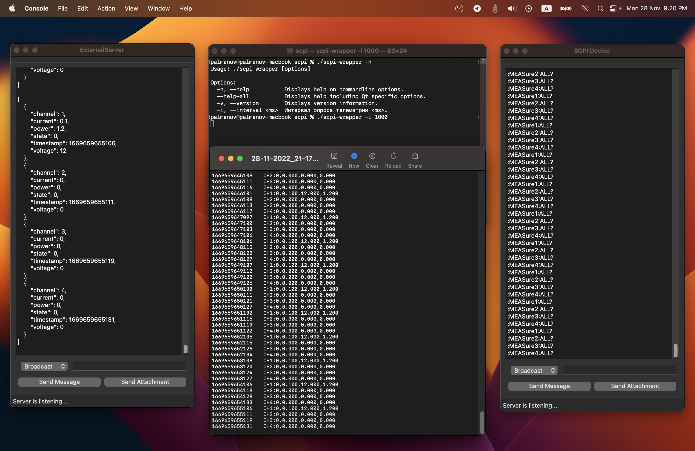

# SCPI Wrapper

Запись демонстрации работы: [Youtube](https://youtu.be/dnIA5wefxgE)

## Набор команд
Команда включения канала питания с параметрами:\
``{"command":"power_on","parameter":{"channel":<number>,"current":<value>,"voltage":<value>}}``\
\
Команда отключения канала питания:\
``{"command":"power_off","parameter":{"channel":<number>}}``\
\
Команда опроса состояния канала питания:\
``{"command":"state","parameter":{"channel":<number>}}``
